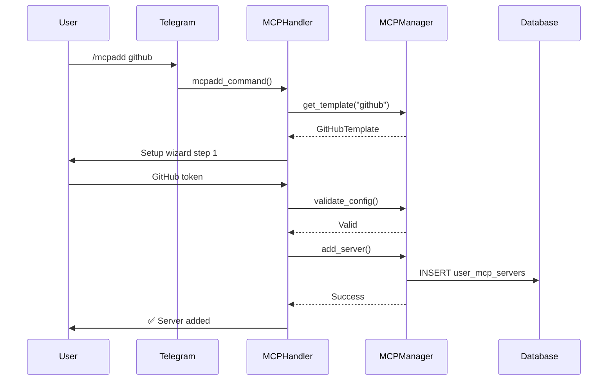
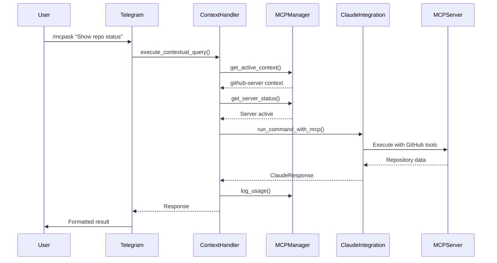

# MCP (Model Context Protocol) - Технічна документація

## Архітектура системи

### Основні компоненти

```
src/mcp/
├── __init__.py              # Ініціалізація модуля
├── manager.py               # MCPManager - основне управління серверами
├── context_handler.py       # MCPContextHandler - контекстні запити
├── server_configs.py        # Конфігурації шаблонів серверів
├── exceptions.py            # MCP-специфічні винятки
└── claude_integration.py    # Розширена інтеграція з Claude CLI
```

### Схема бази даних

```sql
-- Шаблони серверів (попередньо налаштовані)
CREATE TABLE mcp_server_templates (
    id INTEGER PRIMARY KEY AUTOINCREMENT,
    server_type TEXT UNIQUE NOT NULL,
    display_name TEXT NOT NULL,
    description TEXT,
    command_template TEXT NOT NULL,
    args_template TEXT,           -- JSON
    env_template TEXT,            -- JSON
    config_schema TEXT,           -- JSON
    setup_instructions TEXT,
    is_active BOOLEAN DEFAULT 1,
    created_at TIMESTAMP DEFAULT CURRENT_TIMESTAMP
);

-- Користувацькі сервери
CREATE TABLE user_mcp_servers (
    id INTEGER PRIMARY KEY AUTOINCREMENT,
    user_id INTEGER NOT NULL,
    server_name TEXT NOT NULL,
    server_type TEXT NOT NULL,
    server_command TEXT NOT NULL,
    server_args TEXT,             -- JSON
    server_env TEXT,              -- JSON
    config TEXT,                  -- JSON
    is_active BOOLEAN DEFAULT 1,
    is_enabled BOOLEAN DEFAULT 1,
    status TEXT DEFAULT 'inactive',
    last_used TIMESTAMP,
    last_status_check TIMESTAMP,
    error_message TEXT,
    created_at TIMESTAMP DEFAULT CURRENT_TIMESTAMP,
    updated_at TIMESTAMP DEFAULT CURRENT_TIMESTAMP,
    UNIQUE(user_id, server_name)
);

-- Активний контекст користувача
CREATE TABLE user_active_context (
    user_id INTEGER PRIMARY KEY,
    selected_server TEXT,
    context_settings TEXT,        -- JSON
    selected_at TIMESTAMP DEFAULT CURRENT_TIMESTAMP
);

-- Лог використання
CREATE TABLE mcp_usage_log (
    id INTEGER PRIMARY KEY AUTOINCREMENT,
    user_id INTEGER,
    server_name TEXT,
    query TEXT,
    response_time INTEGER,
    success BOOLEAN,
    error_message TEXT,
    cost REAL DEFAULT 0.0,
    session_id TEXT,
    created_at TIMESTAMP DEFAULT CURRENT_TIMESTAMP
);
```

## Класи та їх методи

### MCPManager

```python
class MCPManager:
    """Основний клас управління MCP серверами"""
    
    def __init__(self, config: Settings, storage: Storage)
    
    # Управління серверами
    async def add_server(self, user_id: int, config: MCPServerConfig) -> bool
    async def remove_server(self, user_id: int, server_name: str) -> bool
    async def get_user_servers(self, user_id: int) -> List[Dict[str, Any]]
    async def update_server_status(self, user_id: int, server_name: str, status: str) -> bool
    
    # Статус та моніторинг
    async def get_server_status(self, user_id: int, server_name: str) -> MCPServerStatus
    async def test_server_connection(self, user_id: int, server_name: str) -> bool
    async def enable_server(self, user_id: int, server_name: str) -> bool
    async def disable_server(self, user_id: int, server_name: str) -> bool
    
    # Статистика
    async def log_usage(self, user_id: int, server_name: str, query: str, 
                       success: bool, response_time: int, **kwargs) -> None
    async def get_usage_stats(self, user_id: int, days: int = 7) -> Dict[str, Any]
    async def get_user_server_count(self, user_id: int) -> int
```

### MCPContextHandler

```python
class MCPContextHandler:
    """Обробник контекстних запитів"""
    
    def __init__(self, mcp_manager: MCPManager, claude_integration: ClaudeIntegration, 
                 storage: Storage)
    
    # Управління контекстом
    async def get_active_context(self, user_id: int) -> Optional[Dict[str, Any]]
    async def set_active_context(self, user_id: int, server_name: str, 
                               context_settings: Optional[Dict[str, Any]] = None) -> bool
    async def clear_active_context(self, user_id: int) -> bool
    
    # Виконання запитів
    async def execute_contextual_query(self, user_id: int, query: str,
                                     working_directory: Optional[str] = None,
                                     session_id: Optional[str] = None) -> ClaudeResponse
    
    # Допоміжні методи
    async def get_context_suggestions(self, user_id: int, query: str) -> List[str]
    async def get_context_summary(self, user_id: int) -> Dict[str, Any]
```

### ServerConfigRegistry

```python
class ServerConfigRegistry:
    """Реєстр конфігурацій серверів"""
    
    def get_all_templates(self) -> Dict[str, ServerConfigTemplate]
    def get_template(self, server_type: str) -> Optional[ServerConfigTemplate]
    def validate_config(self, server_type: str, config: Dict[str, Any]) -> bool
    def create_setup_wizard(self, server_type: str) -> SetupWizard
```

## Потік виконання

### Додавання сервера



### Виконання запиту з контекстом



## Конфігурація серверів

### GitHub Integration

```json
{
  "server_type": "github",
  "command_template": "npx",
  "args_template": ["-y", "@modelcontextprotocol/server-github"],
  "env_template": {
    "GITHUB_PERSONAL_ACCESS_TOKEN": "${input:github_token}"
  },
  "config_schema": {
    "type": "object",
    "properties": {
      "github_token": {
        "type": "string",
        "description": "GitHub Personal Access Token",
        "required": true
      }
    }
  }
}
```

### File System Access

```json
{
  "server_type": "filesystem", 
  "command_template": "npx",
  "args_template": ["-y", "@modelcontextprotocol/server-filesystem", "${config:allowed_path}"],
  "env_template": {},
  "config_schema": {
    "type": "object",
    "properties": {
      "allowed_path": {
        "type": "string",
        "description": "Шлях до дозволеної директорії",
        "required": true
      }
    }
  }
}
```

### PostgreSQL Database

```json
{
  "server_type": "postgres",
  "command_template": "npx", 
  "args_template": ["-y", "@modelcontextprotocol/server-postgres", "${config:connection_string}"],
  "env_template": {},
  "config_schema": {
    "type": "object",
    "properties": {
      "connection_string": {
        "type": "string",
        "description": "Рядок підключення PostgreSQL",
        "required": true
      }
    }
  }
}
```

## Обробка помилок

### Типи винятків

```python
class MCPError(Exception):
    """Базовий виняток MCP"""
    pass

class MCPServerNotFoundError(MCPError):
    """Сервер не знайдено"""
    pass

class MCPValidationError(MCPError): 
    """Помилка валідації конфігурації"""
    pass

class MCPContextError(MCPError):
    """Помилка контексту"""
    pass
```

### Обробка в handlers

```python
try:
    result = await mcp_manager.add_server(user_id, config)
except MCPValidationError as e:
    await message.reply_text(
        await t(context, user_id, "mcp.errors.validation_failed", error=str(e))
    )
except MCPError as e:
    await message.reply_text(
        await t(context, user_id, "mcp.errors.add_failed", error=str(e))
    )
```

## Безпека

### Валідація даних

```python
def validate_github_token(token: str) -> bool:
    """Валідація GitHub токена"""
    if not token or len(token) < 20:
        return False
    if not token.startswith(('ghp_', 'github_pat_')):
        return False
    return True

def validate_file_path(path: str) -> bool:
    """Валідація файлового шляху"""
    try:
        resolved = Path(path).resolve()
        # Перевірка на directory traversal
        if '..' in str(resolved):
            return False
        return resolved.exists() and resolved.is_dir()
    except:
        return False
```

### Обмеження доступу

```python
# Максимальна кількість серверів на користувача
MAX_SERVERS_PER_USER = 10

# Час життя сесії
MCP_SESSION_TIMEOUT = 3600  # 1 година

# Розмір запиту
MAX_QUERY_LENGTH = 4000
```

## Моніторинг та логування

### Структуроване логування

```python
logger.info("MCP server added", 
           user_id=user_id, 
           server_name=server_name, 
           server_type=server_type)

logger.error("MCP query failed",
            user_id=user_id,
            server_name=server_name, 
            query=query[:100],
            error=str(e))
```

### Метрики

```python
async def get_usage_stats(self, user_id: int, days: int = 7) -> Dict[str, Any]:
    """Статистика використання"""
    return {
        "total_queries": 42,
        "successful_queries": 40, 
        "success_rate": 95.2,
        "avg_response_time": 1.8,
        "total_cost": 0.045,
        "most_used_server": "github-main"
    }
```

## Розширення системи

### Додавання нового типу сервера

1. **Створіть шаблон у server_configs.py:**

```python
CUSTOM_SERVER_TEMPLATE = ServerConfigTemplate(
    server_type="custom",
    display_name="Custom Integration",
    description="Опис сервера",
    command_template="custom-command",
    args_template=["--arg1", "${config:param1}"],
    env_template={"ENV_VAR": "${input:secret}"},
    config_schema={
        "type": "object", 
        "properties": {
            "param1": {"type": "string", "required": True}
        }
    },
    setup_instructions="Інструкції налаштування"
)
```

2. **Додайте у database migration:**

```sql
INSERT OR IGNORE INTO mcp_server_templates (...) VALUES 
('custom', 'Custom Integration', '...', ...);
```

3. **Додайте валідацію:**

```python
def validate_custom_config(config: Dict[str, Any]) -> bool:
    # Логіка валідації
    return True
```

### Додавання нових можливостей контексту

```python
async def execute_advanced_query(self, user_id: int, query: str, 
                                options: Dict[str, Any]) -> ClaudeResponse:
    """Розширений запит з додатковими опціями"""
    context = await self.get_active_context(user_id)
    
    # Додаткова логіка обробки
    enhanced_prompt = self._enhance_prompt(query, context, options)
    
    return await self.claude_integration.run_command_with_mcp(
        prompt=enhanced_prompt,
        user_id=user_id,
        mcp_server=context['selected_server'],
        **options
    )
```

## Тестування

### Unit тести

```python
import pytest
from src.mcp.manager import MCPManager

@pytest.mark.asyncio
async def test_add_server():
    manager = MCPManager(config, storage)
    
    config = MCPServerConfig(
        server_name="test-github",
        server_type="github", 
        config={"github_token": "test_token"}
    )
    
    result = await manager.add_server(user_id=123, config=config)
    assert result is True

@pytest.mark.asyncio 
async def test_context_execution():
    handler = MCPContextHandler(manager, claude, storage)
    
    await handler.set_active_context(123, "test-server")
    result = await handler.execute_contextual_query(123, "test query")
    
    assert result.success is True
```

### Інтеграційні тести

```python
async def test_full_mcp_workflow():
    # 1. Додати сервер
    await mcpadd_command(update, context)
    
    # 2. Вибрати контекст  
    await mcpselect_command(update, context)
    
    # 3. Виконати запит
    await mcpask_command(update, context)
    
    # 4. Перевірити результат
    assert context.bot_data["last_response"].success
```

## Продуктивність

### Кешування

```python
from functools import lru_cache
from asyncio import TTL_CACHE

@lru_cache(maxsize=100)
def get_server_template(server_type: str) -> ServerConfigTemplate:
    """Кешування шаблонів серверів"""
    return SERVER_TEMPLATES.get(server_type)

class MCPManager:
    def __init__(self):
        self._status_cache = {}
        self._status_cache_ttl = 300  # 5 хвилин
    
    async def get_server_status(self, user_id: int, server_name: str):
        cache_key = f"{user_id}:{server_name}"
        now = time.time()
        
        if cache_key in self._status_cache:
            cached_at, status = self._status_cache[cache_key]
            if now - cached_at < self._status_cache_ttl:
                return status
        
        # Отримати актуальний статус
        status = await self._check_server_status(user_id, server_name)
        self._status_cache[cache_key] = (now, status)
        return status
```

### Оптимізація запитів

```python
async def get_user_servers_batch(self, user_ids: List[int]) -> Dict[int, List[Dict]]:
    """Батчева обробка запитів"""
    async with self.storage.db_manager.get_connection() as conn:
        placeholders = ','.join('?' * len(user_ids))
        cursor = await conn.execute(f"""
            SELECT user_id, server_name, server_type, status, is_enabled
            FROM user_mcp_servers 
            WHERE user_id IN ({placeholders})
        """, user_ids)
        
        results = {}
        async for row in cursor:
            user_id = row['user_id']
            if user_id not in results:
                results[user_id] = []
            results[user_id].append(dict(row))
        
        return results
```

---

*Ця технічна документація описує внутрішню архітектуру MCP системи та може бути використана розробниками для розширення функціональності.*